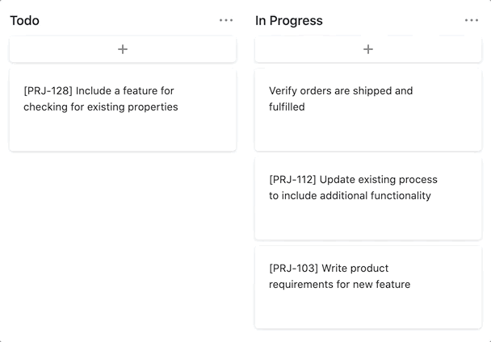

# asana-task-id

Adds a project code prefix to new tasks added in Asana using a service deployed to [Vercel](https://vercel.com).



e.g. `[PRJ-#] Task Name`

## Deployment

### Prerequisites

Install package dependencies

```sh
yarn
```

### Deploy Application

```sh
now --prod
```

### Add Environment Variables

Rename the `.env.example` file to `.env` and update with the required values.

```
ASANA_ACCESS_TOKEN=<Asana Personal Access Token>
ASANA_PROJECT_ID=<Asana Project ID>
ASANA_PROJECT_PREFIX=<Project Task Prefix>
```

Add the same [environment variable values](https://vercel.com/blog/environment-variables-ui) to the Vercel project.

```sh
now env add ASANA_ACCESS_TOKEN production
# Add ASANA_ACCESS_TOKEN value
```

```sh
now env add ASANA_PROJECT_ID production
# Add ASANA_PROJECT_ID value
```

```sh
now env add ASANA_PROJECT_PREFIX production
# Add ASANA_PROJECT_PREFIX value
```

### Register Hook

Execute the Asana webhook registration script on the deployed production URL.

```sh
yarn run register --url https://<PROJECT_URL>.now.sh/api/asana
```

## Additonal Configuration

### Environment Variables

`WATCH_CHANGES` Enables prefixes to be added to tasks that already exist when an update occurs to any field within the task. (`true`/`false`) [Default = `false`] [*Optional*]
